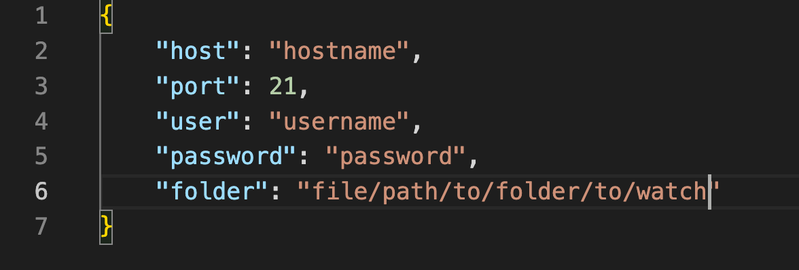

# absentlistener filehandler
## overview
- watches a specific folder/directory for the addition and changes (saved) of aiff or wav files. 
- if a file is added to the specified folder and then saved/changed (as this is how max ~sfplay records audio) then the audio file is converted to an mp3 with the same name with a UTC timestamp added (to avoid conflicting names)
- once the file is converted to an mp3 the file is uploaded to a website using an ftp client
## setup
1. download node if it is not currently installed
2. clone or download zip of absentlistener_filehandler
3. setup PRIVATE config file - DO NOT SAVE TO GITHUB
    - create a json file with the following info and save in the filehandler folder : 
    
 

 
  

4.  open filehandler.maxpat          